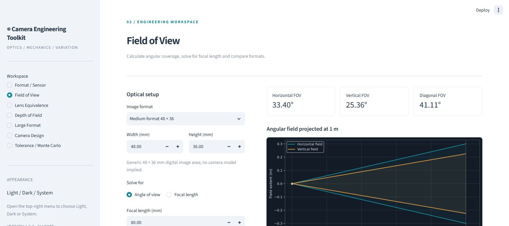

# Camera Engineering Toolkit

**An open-source photographic and camera engineering workbench.**

Calculate image geometry, compare lenses, estimate depth of field, check large-format coverage, build mechanical stacks and simulate manufacturing variation. An English Streamlit interface keeps editable inputs next to numerical results and engineering diagrams. Choose **Light, Dark or System** from the **⋮ menu** at the top right.



## Tools in v1.0

| Workspace | Capabilities |
| --- | --- |
| Format / Sensor | Diagonal, aspect ratio, area, diagonal crop factor, separate X/Y pixel pitch, pixel density |
| Field of View | Horizontal, vertical and diagonal angles; inverse focal-length solver; multiple-format and multiple-focal-length comparison |
| Lens Equivalence | Horizontal/vertical/diagonal matching; approximate equivalent DOF aperture with explicit assumptions |
| Depth of Field | Editable CoC, hyperfocal distance, near/far limits, total/front/rear depth, infinity handling |
| Large Format | Bellows magnification, exposure factor/stops, image-circle coverage including simultaneous rise and shift |
| Camera Design | Signed component chain, sensor-plane error, correction, tolerance envelope, recorded back envelope |
| Tolerance / Monte Carlo | Uniform and normal distributions, signed components, seed, up to 250,000 samples, central 95% interval, out-of-spec fraction, histogram |

Fourteen representative image-area presets include 135, two APS-C examples, Micro Four Thirds, digital medium formats, 645, 6×6, 6×7, 6×9, 4×5, 5×7 and 8×10. Every format can be customized. Sheet-film presets describe approximate usable image areas, not sheet size or guaranteed holder apertures.

Every completed calculation exports JSON and CSV with inputs, results, units, version and UTC timestamp. Monte Carlo also exports every sample. Inputs persist when navigating within a browser session; download records before closing it. JSON infinity is the string `"Infinity"` so files remain valid JSON.

## Run locally

Requires **Python 3.11 or newer**. End users of a hosted instance need only a browser.

```sh
python -m venv .venv
# Windows:
.venv\Scripts\activate
# macOS / Linux:
# source .venv/bin/activate
python -m pip install -r requirements.txt
python -m streamlit run app.py
```

On Windows, `launch.bat` creates a project-local environment on first use and opens the app. This first run needs an internet connection for the packages. Later launches reuse the environment.

## Deployment

The application requires a Python server. GitHub Pages cannot execute it. See [deployment instructions](docs/DEPLOYMENT.md) for Streamlit Community Cloud and Docker. No database, API keys or external calculation service is required.

## Examples

- **48 × 36 mm, 80 mm lens:** horizontal FOV **33.398488°**, diagonal-format equivalent **57.688820 mm** on 135. Matching the horizontal angle instead gives **60 mm** because the aspect ratios differ.
- **150 mm lens at 300 mm total bellows extension:** **1:1** magnification, **4×** exposure, **+2 stops**.
- **40 + 10 + 20 mm stack with a 70 mm target:** zero nominal error. Independent uniform tolerances of ±0.05, ±0.03 and ±0.02 mm give an analytic standard deviation of **0.035590 mm**.

Example inputs and an exported calculation record are in [examples/](examples/). The optional CLI is available after `python -m pip install .`:

```sh
cet fov --width 48 --height 36 --focal 80
```

## Accuracy and scope

Calculations use documented rectilinear, paraxial or geometric models. [Models and conventions](docs/MODELS.md) explains the equations, principal-plane reference, circle-of-confusion convention, sign conventions, and statistical interpretation. The toolkit does not perform ray tracing, distortion correction, lens design, collision detection, tilt/swing analysis, or optical tolerance analysis. Normal tolerance samples have unbounded tails; independent sampling does not model correlated manufacturing errors.

Values are computed on the server in session memory. The app does not write user inputs to a database or send them to third-party analytics. Anyone hosting it controls the runtime and its normal infrastructure logs.

## Development

```sh
python -m pip install -r requirements-dev.txt
python -m pytest -q
python -m build
```

Tests cover physical reference cases, inverse round trips, thin-lens blur at DOF limits, hyperfocal boundaries, coverage corners, signed stacks, analytic statistical checks, invalid inputs, exports and every Streamlit page. CI exercises Python 3.11, 3.12 and 3.14.

```text
app.py                   Streamlit interface
cet/core.py              UI-independent calculation library
cet/charts.py            Matplotlib engineering diagrams
cet/export.py            JSON / CSV records
cet/cli.py               Optional command-line entry point
cet/data/formats.json    Representative active-image-area presets
tests/                   Numerical and interface tests
docs/                    Models, deployment, release notes and screenshots
examples/                Example parameter sets and exported results
```

Contributions should include units, an explained convention and a numerical reference case for any new model. MIT licensed; see [LICENSE](LICENSE).
