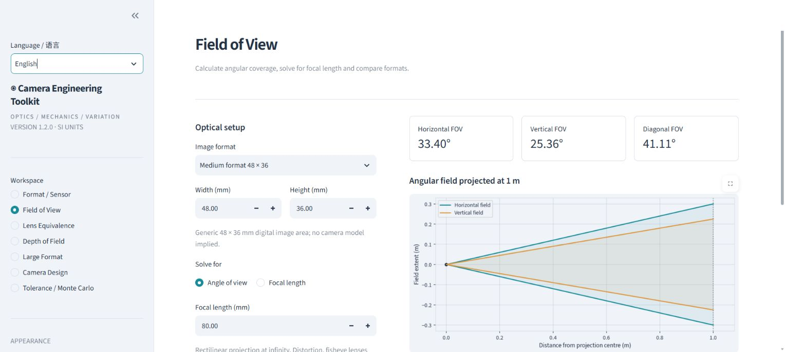
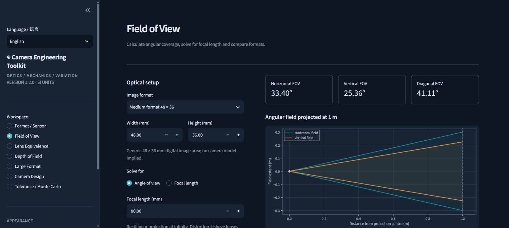

# Camera Engineering Toolkit

**v1.2.0 · Engineering Reliability Update**

Camera Engineering Toolkit combines photographic calculations with explicit engineering models, tolerance analysis and reproducible design records.

**[Open the live app](https://camera-engineering-toolkit.streamlit.app/)** · [Source code](https://github.com/inkcat-qwq/Camera-Engineering-Toolkit) · [Automated validation](https://github.com/inkcat-qwq/Camera-Engineering-Toolkit/actions)

Calculate image geometry, compare lenses, estimate depth of field, check large-format coverage, build mechanical stacks and simulate manufacturing variation. Choose **English** or **简体中文** using **Language / 语言** at the top of the sidebar. All seven workspaces include translated parameters, results, explanations, validation messages and chart labels. Inputs, editable component records and completed simulations persist when switching languages in the same session. Choose **Light** or **Dark** in the sidebar; widgets and charts redraw together immediately.

**中文使用：** 打开侧栏，在顶部 **Language / 语言** 中选择 **简体中文**。七个工具的参数、结果、说明、错误提示和图表均支持中文；切换语言会保留本次会话中的输入与模拟结果。侧栏的 **主题** 同步控制界面与图表的浅色／深色模式。景深默认使用从像平面测量的距离；相机设计与蒙特卡洛共用同一条尺寸链。窄屏设备可先点击左上角按钮展开侧栏。

JSON/CSV records retain stable English field names and canonical option values for compatibility with existing scripts. User-entered component names are preserved exactly, including Chinese. Streamlit's own menu, table toolbar and hosting controls retain the framework's language. Chart fonts are bundled, so Chinese labels do not depend on system fonts or a runtime download.



## Tools in v1.2.0

| Workspace | Capabilities |
| --- | --- |
| Format / Sensor | Diagonal, aspect ratio, area, diagonal crop factor, separate X/Y pixel pitch, pixel density |
| Field of View | Horizontal, vertical and diagonal angles; inverse focal-length solver; multiple-format and multiple-focal-length comparison |
| Lens Equivalence | Horizontal/vertical/diagonal matching; approximate equivalent DOF aperture with explicit assumptions |
| Depth of Field | Explicit image-plane / principal-plane datum, editable CoC, hyperfocal, near/far limits, adaptive total/front/rear depth, infinity handling |
| Large Format | Bellows magnification, exposure factor/stops, image-circle coverage including simultaneous rise and shift |
| Camera Design | Shared signed chain and target, nominal position, error, correction, bounded worst case / stated envelope, RSS sigma, optional back-envelope record |
| Tolerance / Monte Carlo | Same chain, independent Uniform / Normal models, seed, up to 250,000 samples, central 95% assembly interval, failure count and 95% Wilson probability interval, histogram |

Fourteen presets distinguish digital active sensors, roll-film image areas and sheet film through stable IDs, categories, notes and provenance. Sheet presets record **nominal sheet size separately from representative usable image area**: for example, 5×7 has a nominal sheet of 177.8×127 mm and an illustrative 170×120 mm opening. Actual holders vary; measure yours and edit width/height. Every format remains customizable.

Every completed calculation exports JSON and CSV with inputs, results, units, version and UTC timestamp. Monte Carlo also exports every sample. Inputs persist when navigating within a browser session; download records before closing it. JSON infinity is the string `"Infinity"` so files remain valid JSON. **Export schema 2** adds datum and preset metadata; DoF result distances follow the selected datum, while the legacy input `distance_mm` remains principal-plane object distance. See [release notes](docs/RELEASE_NOTES.md) for migration details.



## Run locally

Requires **Python 3.11 or newer**. End users of a hosted instance need only a browser.

```sh
python -m venv .venv
# Windows:
.venv\Scripts\activate
# macOS / Linux:
# source .venv/bin/activate
python -m pip install -r requirements.txt
python -m streamlit run app.py
```

On Windows, `launch.bat` creates a project-local environment on first use and opens the app. This first run needs an internet connection for the packages. Later launches reuse the environment.

## Deployment

The public instance runs on Streamlit Community Cloud from `main/app.py` with Python 3.14. The application requires a Python server. GitHub Pages cannot execute it. See [deployment instructions](docs/DEPLOYMENT.md) for Streamlit Community Cloud and Docker. No database, API keys or external calculation service is required.

## Examples

- **48 × 36 mm, 80 mm lens:** horizontal FOV **33.398488°**, diagonal-format equivalent **57.688820 mm** on 135. Matching the horizontal angle instead gives **60 mm** because the aspect ratios differ.
- **150 mm lens at 300 mm total bellows extension:** **1:1** magnification, **4×** exposure, **+2 stops**.
- **40 + 10 + 20 mm stack with a 70 mm target:** zero nominal error. Independent uniform tolerances of ±0.05, ±0.03 and ±0.02 mm give an analytic standard deviation of **0.035590 mm**.
- **100 mm lens, subject 450 mm from the image plane:** thin-lens object distance is 300 mm and focused image distance is 150 mm. Near/far limits use that same image plane. The image-plane option selects magnification ≤1; use principal-plane mode for the other conjugate branch.
- **0 failures / 1,000 samples:** the two-sided 95% Wilson interval is 0–0.382676% before display rounding. Zero observed failures does not establish zero risk.

Example inputs and an exported calculation record are in [examples/](examples/). The optional CLI is available after `python -m pip install .`:

```sh
cet fov --width 48 --height 36 --focal 80
```

## Accuracy and scope

Calculations use documented rectilinear, paraxial or geometric models. [Models and conventions](docs/MODELS.md) explains the equations, principal-plane reference, circle-of-confusion convention, sign conventions, and statistical interpretation. The toolkit does not perform ray tracing, distortion correction, lens design, collision detection, tilt/swing analysis, or optical tolerance analysis. Normal tolerance samples have unbounded tails; independent sampling does not model correlated manufacturing errors.

Values are computed on the server in session memory. The app does not write user inputs to a database or send them to third-party analytics. Anyone hosting it controls the runtime and its normal infrastructure logs.

## Development

```sh
python -m pip install -r requirements-dev.txt
python -m pytest -q
python -m build
```

Tests cover physical reference cases, inverse round trips, thin-lens blur at DOF limits, hyperfocal boundaries, coverage corners, signed stacks, analytic statistical checks, invalid inputs, exports and every Streamlit page. CI exercises Python 3.11, 3.12 and 3.14.

```text
app.py                   Streamlit interface
cet/core.py              UI-independent calculation library
cet/display.py           Adaptive pure length, angle and probability formatting
cet/formats.py           Preset schema and active / nominal area metadata
cet/chain.py             Shared dimension-chain model
cet/theme.py             Session theme palette and native widget synchronization
cet/charts.py            Matplotlib engineering diagrams
cet/i18n.py              English / Simplified Chinese presentation layer
cet/export.py            JSON / CSV records
cet/cli.py               Optional command-line entry point
cet/data/formats.json    Versioned preset catalog with provenance
tests/                   Numerical and interface tests
docs/                    Models, deployment, release notes and screenshots
examples/                Example parameter sets and exported results
```

Contributions should include units, an explained convention and a numerical reference case for any new model. Application code is MIT licensed; see [LICENSE](LICENSE). The bundled [Noto Sans SC font](https://github.com/google/fonts/tree/main/ofl/notosanssc) uses the SIL Open Font License 1.1; its license is included in `cet/data/fonts/OFL.txt`.
